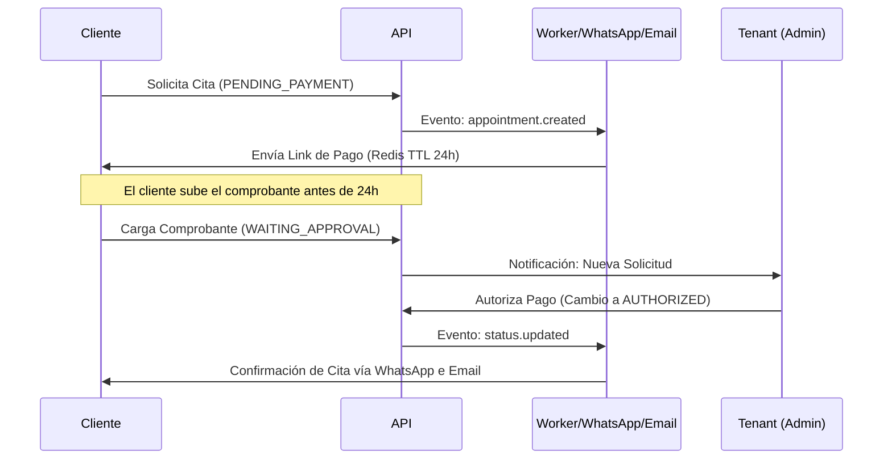

# 02 Flujo de Reserva y Comprobante

```mermaid
sequenceDiagram
    participant C as Cliente
    participant A as API
    participant W as Worker/WhatsApp/Email
    participant T as Tenant (Admin)
    
    C->>A: Solicita Cita (PENDING_PAYMENT)
    A->>W: Evento: appointment.created
    W->>C: Envía Link de Pago (Redis TTL 24h)
    Note over C,A: El cliente sube el comprobante antes de 24h
    C->>A: Carga Comprobante (WAITING_APPROVAL)
    A->>T: Notificación: Nueva Solicitud
    T->>A: Autoriza Pago (Cambio a AUTHORIZED)
    A->>W: Evento: status.updated
    W->>C: Confirmación de Cita vía WhatsApp e Email
```

---
> [!NOTE]
> Si el tiempo expira sin carga de comprobante, un proceso de limpieza en Redis/Worker marcará la cita como `CANCELLED`.
