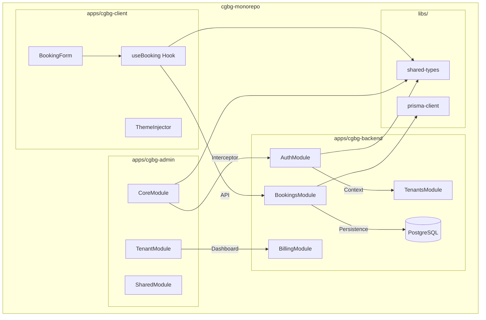

# 05 Jerarquía de Componentes

```mermaid
graph TD
    subgraph "cgbg-monorepo"
        subgraph "apps/cgbg-backend"
            B1[AuthModule]
            B2[TenantsModule]
            B3[BookingsModule]
            B4[BillingModule]
            B1 -->|Context| B2
            B3 -->|Persistence| DB[(PostgreSQL)]
        end

        subgraph "apps/cgbg-client"
            C1[ThemeInjector]
            C2[BookingForm]
            C3[useBooking Hook]
            C2 --> C3
            C3 -->|API| B3
        end

        subgraph "apps/cgbg-admin"
            A1[CoreModule]
            A2[SharedModule]
            A3[TenantModule]
            A1 -->|Interceptor| B1
            A3 -->|Dashboard| B4
        end

        subgraph "libs/"
            L1[shared-types]
            L2[prisma-client]
            B1 --> L1
            C3 --> L1
            A1 --> L1
            B3 --> L2
        end
    end
```

---
> [!NOTE]
> Las aplicaciones consumen tipos de datos desde `libs/shared-types` para asegurar que las interfaces coincidan en todo el monorepo (Front-to-Back).
